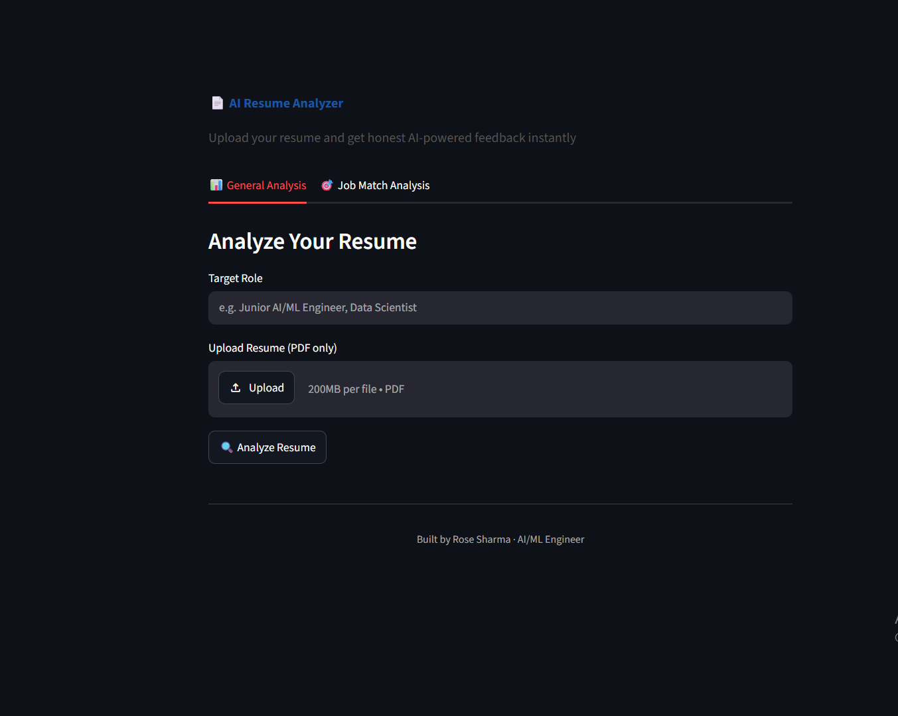

# 📄 AI Resume Analyzer

An AI-powered resume analysis tool built with **Groq LLaMA 3.3 70B** and **Streamlit**.

[](https://resume-analyzer-rose.streamlit.app)
[](https://python.org)
[](https://groq.com)

---

## What It Does

- **General Analysis** — Upload your resume PDF and get structured feedback on strengths, weaknesses, missing skills, project quality, and ATS keywords for any target role
- **Job Match Analysis** — Paste a job description and get a match score with specific resume tweaks to improve your chances

## Results

- Analysis generated in under 15 seconds via Groq's fast inference
- Structured feedback with 7 sections — score, strengths, gaps, skills, projects, action items, ATS keywords
- Downloadable analysis report as a text file

## Tech Stack

| Layer | Technology |
|-------|-----------|
| Frontend | Streamlit |
| AI Engine | Groq API — LLaMA 3.3 70B Versatile |
| PDF Parsing | PyPDF2 |
| Language | Python 3.10+ |

## Screenshots

### Home — General Analysis Tab


## Setup

### 1. Clone the repo
```bash
git clone https://github.com/Rosesharma13/resume-analyzer.git
cd resume-analyzer
```

### 2. Install dependencies
```bash
pip install -r requirements.txt
```

### 3. Add your Groq API key

Create `.streamlit/secrets.toml`:
```toml
GROQ_API_KEY = "your_groq_api_key_here"
```

Get a free key at: https://console.groq.com

### 4. Run the app
```bash
streamlit run app.py
```

## Project Structure

```
resume-analyzer/
├── app.py              # Main Streamlit application
├── requirements.txt    # Python dependencies
├── .env.example        # Environment variable template
├── .gitignore
├── screenshot/
│   └── resume-analyzer-home.png
└── README.md
```

---

Built by [Rose Sharma](https://linkedin.com/in/rose-sharma13) · AI/ML Engineer · [Portfolio](https://rosesharma13.github.io)
